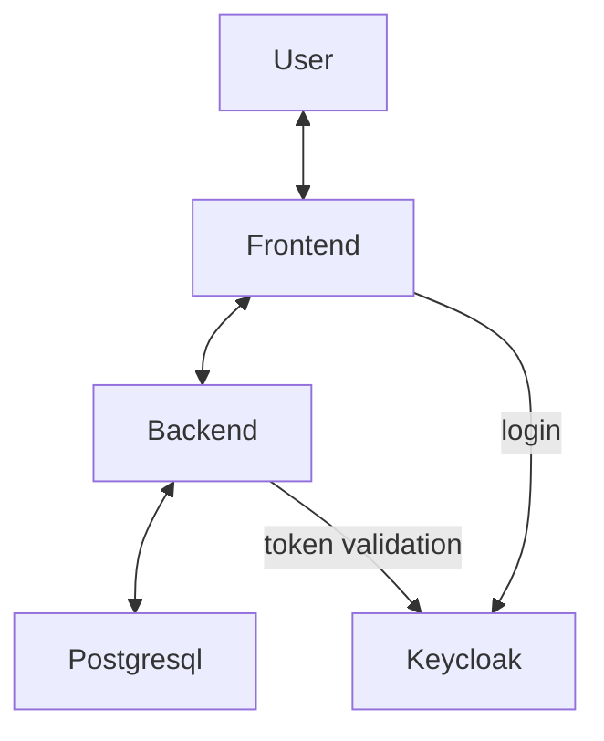
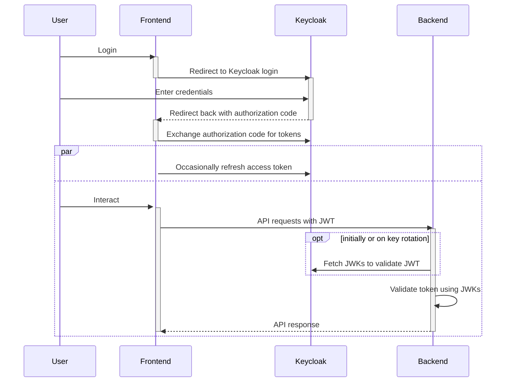

## Component diagram

## Auth diagram

This diagram shows how the system handles authorization using Keycloak.

You can find an in-depth description of the authorization code flow [here](https://auth0.com/docs/get-started/authentication-and-authorization-flow/authorization-code-flow) (i.e. of the interaction between user, frontend and Keycloak).

