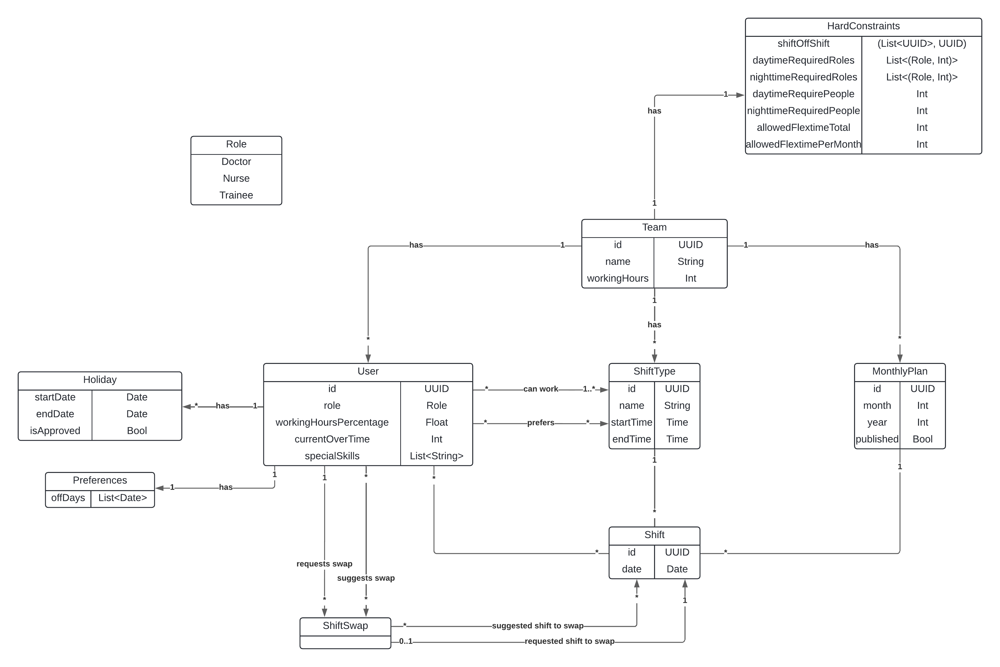

# Project Name: MediTrack

Table of Contents
=================
* [Team Members](#team-members)
* [Initial Situation & Existing Similar Products](#initial-situation--existing-similar-products)
* [Project Description](#project-description)
* [Target Audience](#target-audience)
* [Functional Requirements](#functional-requirements)
  * [Use Case Overview](#use-case-overview)
  * [Iceberg List](#iceberg-list)
* [Non-Functional Requirements](#non-functional-requirements)
* [Domain Model](#domain-model)
* [Working Structure & Simple Project Plan](#working-structure--simple-project-plan)
  * [Distribution of Roles](#distribution-of-roles)
  * [Horizontal Responsibilities](#horizontal-responsibilities)
  * [Simple Project Plan](#simple-project-plan)
    * [Work Breakdown Structure (WBS)](#work-breakdown-structure-wbs)
    * [Milestone Description](#milestone-description)
* [Project Boundaries](#project-boundaries)
* [Supply Components](#supply-components)
  * [Software](#software)
  * [Artifacts & Documentation](#artifacts--documentation)
  * [What Won't Be Delivered](#what-wont-be-delivered)
* [Risk Assessment](#risk-assessment)
* [Information Process](#information-process)
* [Special Features](#special-features)
## Team Members 

| Name               | Matr. Nr. | E-Mail                            | Primary Role         | Secondary Role    |
|--------------------|-----------|-----------------------------------|----------------------|-------------------|
| Cobzaru Luca Marius | 11712226 | e11712226@student.tuwien.ac.at | Frontend UI/UX       | Test Manager            |
| Grassauer Alina    | 11905176  | alina.grassauer@tuwien.ac.at     | Team Coordinator     | Frontend UI/UX   |
| Gülmez Gülsüm      | 11905145  | e11905145@student.tuwien.ac.at   | Test Manager               | Quality Manager  |
| Kitzberger Gabriel | 12024014  | gabriel.kitzberger@student.tuwien.ac.at | Technical Architect | Auth & Security  |
| Petermandl Jakob   | 11776823  | e11776823@student.tuwien.ac.at    | Quality Manager      | Documentation    |
| Wolkersdorfer Lucas | 11922587 | e11922587@student.tuwien.ac.at | Requirements Engineer | Technical Architect |

## Initial Situation & Existing Similar Products

Healthcare facilities face significant challenges in efficiently scheduling medical staff. The traditional methods of manually creating schedules are time-consuming, prone to errors, and often fail to consider the unique requirements of healthcare settings, such as 12-hour shifts, weekend shifts, and 24/7 staffing needs. The solution to these problems is a healthcare staff scheduling software that automates this whole process.

**Existing scheduling software solutions** in the market are generic and do not adequately address these specific challenges faced by healthcare facilities. As a result, department managers and Human Resources departments struggle to manage employee schedules effectively, leading to inefficiencies, dissatisfaction among staff, and potential disruptions in patient care.

Likewise, in the area of staff scheduling within healthcare settings, several existing softwares exist, each catering to various aspects of scheduling and workforce management. Some notable examples include: MediShift, PlanerIO, findmyshift, shiftboard, and Everhour.

Comparing our project idea with the most widely used sheduling software MakeShift, which also has a specialization in healthcare, our special features clearly stand up. While MakeShift provides some features that are beneficial for scheduling medical staff, there are two aspects where our idea offers more specialized and tailored solutions for healthcare facilities:
1. **Healthcare-Specific Features:** 12-hour shifts, weekend rotations, and 24/7 staffing requirements
2. **Automated Schedule Creation:** Automated schedule creation based on staff availability, preferences, and off-days

## Project Description

Our project's goal is to create a specialized web-application for scheduling medical staff that meets the unique needs of healthcare facilities. This platform automates the staff scheduling process based on their availability and preferences, aiming to optimize planning tasks that traditionally consume a lot of time and effort.

Healthcare facilities face specific challenges like 12-hour shifts, weekend shifts, and 24/7 staffing requirements, which are often overlooked by planning softwares. Our platform addresses these challenges by automating schedule creation and considering factors such as staff availability, preferences, and off-days.

By replacing traditional planning methods with automation, our platform significantly improves time management in healthcare facilities. It offers features tailored specifically for scheduling medical personnel and has the potential to replace generic planning tools, providing a comprehensive solution for optimizing scheduling processes and increasing efficiency.

Our main customers are hospitals and medical facilities, benefiting department heads and HR departments by enabling them to effortlessly manage employee schedules. Employees also benefit by inputting their preferences and personal data, contributing to a fair and balanced approach to scheduling.

The application serves as a central hub for medical facilities, department heads, and employees, providing essential features like user registration, authentication, and team management. Additionally, it offers advanced features such as customizable shift templates, real-time schedule updates, and options for vacation requests and shift swaps.

With a user-friendly interface and advanced planning capabilities, our solution aims to revolutionize scheduling practices in healthcare and ultimately increase employee satisfaction and optimize workforce management.

## Target Audience

**Department Managers (DMs)** use the system for the organizational and administrative tasks related to staff management. This includes creating employee accounts for their team. Furthermore, they define employee roles and special skills and assign these roles and skills to individuals. DMs can set staffing levels and define scheduling rules, including the types of shifts available and specifying required roles for each shift. They generate monthly schedules, modify and publish schedules. Additionally, DMs manage holiday requests and can generate roster PDFs.

**Employees** use the system to view their work schedules and set holiday/off-day preferences. Employees can request up to three preferred off-days per month, submit requests for holidays, and engage in shift swaps with colleagues. Once schedules are published, employees can access their team's roster to view the shifts they have been assigned. They can filter the roster by various criteria such as role, skills, and name.

| Actor | Rights in the system| Remarks |
| ------ | ------ | ------ |
| DMs | Is the customer and primary user; has unrestricted access to all services | Can create accounts for the employees |
| Employee | Is the secondary user; can view the team roster, personal information and shift swap offers |  Are not able to edit their personal data |

## Functional Requirements

| Feature| Description| Customer Priority | Effort |
|---------|-----------|-------------------|--------|
| Account Creation | DM can register an account. | High| 3 |
| Employee Management | DM can add employees and enter details such as professional group, employment extent (%) and other details (eg. prefers night shifts). | High | 4 |
| Employee Login | Employees can log in to their accounts. | High | 3 |
| Special Skills Tagging| DM can tag employees with additional skills (e.g., wound management, dementia care). | Low | 2 |
| Shift Type Creation| DM can create service types (eg. D12 - day shift from 7:15 to 19:15) and assign them to employees. | High | 4 |
| Rule Configurations   | DM can set basic rules for scheduling (e.g., maximum consecutive (night) shifts, always 2 diploma nurse present, etc. ). | High | 5 |
| Automatic Scheduling| DM can create monthly schedules automatically, edit, and publish them. | High | 8 |
| Shift Swapping| Employees can swap shifts with others. | Medium | 3 |
| Duty Roster Access | Employees can view the duty roster. | Medium | 4 |
| Off-Time Management| Employees can enter holidays and 3 days-off per month, approval by DM.|Medium| 2 |
| Duty Roster PDFs| DM/Employees can download duty roster PDFs (without/with filters).| High  | 1 |

### Use Case Overview

The features have been summarized in the following use case packages. 

1. Account Management 
2. Employee Management 
3. Roles and Skills 
4. Shift and Rule Configurations 
5. Scheduling System 
6. Roster Access 
7. Time-Off and Shift Swapping

### Iceberg List

| ID   | Feature, Actor                           | Use Case                            | Customer-priority | Effort | Version | Responsible |
|------|------------------------------------------|-------------------------------------|-------------------|--------|---------|-------------|
| 1.1  | Account Creation, DM           | Register DM Account                 | High              | 2      | 1       | Gabriel     |
| 1.2  | Account Creation, DM        | Login DM Account                    | High              | 1      | 1       | Gabriel     |
| 1.3  | Account Creation, DM          | Change DM Password                  | High              | 1      | 1       | Gabriel     |
| 3.1  | Roles and Skills, DM           | Define Employee Roles               | High              | 3      | 1       | Jakob       |
| 4.1  | Shift and Rule Configurations, DM | Define Shift Types                  | High              | 3      | 1       | Jakob       |
| 4.2  | Shift and Rule Configurations, DM | Remove Shift Types                  | Low               | 1      | 1       | Jakob       |
| 2.1  | Employee Management, DM     | Create Employee Account             | High              | 4      | 1       | Gabriel     |
| 2.2  | Employee Management, DM        | Delete Employee Account             | Low               | 1      | 1       | Gabriel     |
| 3.2  | Roles and Skills, DM       | Assign Roles to Employees           | High              | 1      | 1       | Jakob       |
| 4.2  | Shift and Rule Configurations, DM | Assign Shift Types to Employees     | High              | 1      | 1       | Jakob       |
| 4.3  | Shift and Rule Configurations, DM | Manage Scheduling Rules             | High              | 4      | 2       | Lucas       |
| 4.3.1| Shift and Rule Configurations, DM | Specify Required Roles              | High              | 2      | 2       | Lucas       |
| 4.3.2| Shift and Rule Configurations, DM | Set Staffing Levels                 | Medium            | 2      | 2       | Lucas       |
| 5.1  | Scheduling System, DM     | Generate Monthly Schedule           | High              | 10     | 2       | Gabriel/Lucas|
| 2.3  | Employee Management, DM        | View Employee Profiles              | Medium            | 2      | 2       | Luca        |
| 2.4  | Employee Management, DM        | Edit Employee Profile Details       | Medium            | 3      | 2       | Luca        |
| 1.4  | Account Creation, Employee     | Login Employee Account              | High              | 1      | 2       | Gabriel     |
| 7.2  | Roster access, Employee        | Access Personal Roster              | High              | 3      | 2       | Luca        |
| 6.1  | Time-off and Shift Swapping, Employee | Declare 3 Preferred Off-Days    | Medium            | 3      | 3       | Alina       |
| 6.4  | Time-off and Shift Swapping, Employee | Submit Holiday Requests         | Medium            | 3      | 3       | Alina       |
| 6.5  | Roster Access, DM         | Approve/Deny Holiday Requests       | Medium            | 2      | 3       | Alina       |
| 1.5  | Account Creation, Employee    | Change Employee Password           | Low               | 1      | 3       | Gabriel     |
| 3.5  | Roles and Skills, DM            | Change Employee Preferences         | Medium            | 4      | 3       | Alina       |
| 5.2  | Scheduling System, DM          | Modify Schedule                     | Medium            | 5      | 3       | Alina       |
| 5.3  | Scheduling System, DM           | Publish Schedule                    | High              | 2      | 3       | Alina       |
| 7.1  | Roster access, DM           | Generate Roster PDFs                | Medium            | 2      | 4       | Gülsüm      |
| 6.3  | Time-off and Shift Swapping, Employee | Swap Shifts                    | Medium            | 4      | 4       | Gülsüm      |
| 6.3.1| Time-off and Shift Swapping, Employee | Provide Shift for Swapping     | Medium            | 2      | 4       | Gülsüm      |
| 6.3.2| Time-off and Shift Swapping, Employee | View Shifts Others Want to Swap| Medium            | 3      | 4       | Gülsüm      |
| 6.3.3| Time-off and Shift Swapping, Employee | Request Shift Swap            | Medium            | 2      | 4       | Gülsüm      |
| 6.3.4| Time-off and Shift Swapping, Employee | Approve Shift Swap            | Medium            | 1      | 4       | Gülsüm      |
| 3.3  | Roles and Skills, DM          | Define Special Skills               | Low               | 3      | 4       | Lucas       |
| 3.4  | Roles and Skills, DM         | Assign Special Skills to Employees  | Low               | 1      | 4       | Lucas       |
| 7.3  | Roster access, Employee       | Filter Roster by Role, Skills, and Name | Low         | 2      | 4       | Lucas       |

## Non-Functional Requirements

**Performance**

- Roster Generation: Generation of monthly schedules should not exceed 10 seconds for up to 50 employees (in US).
- PDF Generation: Generating duty roster PDFs for a month should take no longer than 10 seconds (in US).

**Scalability**

- Concurrent Users: The application must support simultaneous access for up to 50 users, maintaining a response time of less than 3 seconds (in US).

**Usability**
- UI Load Time: UI elements load within 3 seconds using standard broadband connections.
- Error Messages: Provide clear error messages within a second of an error occuring.
- Accessibility Standards: Comply with WCAG 2.1 AA accessibility standards, verified with accessibility tools.
- Browser Compatibility: The application must be fully functional on the latest versions of major browsers (Google Chrome, Mozilla Firefox, Safari, and Edge).
- Access to Core Functionality: Users must be able to access core functionality within at most 3 clicks from the application’s main page.
-Core Functionality User Training: A novice user should be able to use the application’s core functionality effectively with no more than 10 minutes of initial training.

**Browser Compatibility**

- The application must be fully functional on the latest versions of major browsers (Google Chrome, Mozilla Firefox, Safari, and Edge).

**Security**

- Data Security: Rosters can only be viewed by DMs and employees of that department.

## Domain Model

## Working Structure & Simple Project Plan

The team consists of 6 people, which are mentioned in the [Team Members](#team-members) section. The project uses SCRUM.

### Distribution of Roles

 See [Team Members](#team-members)

### Horizontal Responsibilities

##### Team Coordinator:
- Represents the team in discussions with stakeholders
- Manages project organization and coordination
- Oversees workload distribution
- Supports communication within the team
- Organizes internal and external meetings, including JFX's, IR's, and MR's

##### Technical Architect:
- Designs program architecture
- Manages dependencies and ensures architectural integrity
- Provides expertise in utilized technologies and guides technical decision-making
- Collaborates with team members to address technical challenges

##### Test Manager:
- Manages test infrastructure and environments
- Develops test plans
- Executes integration, system, and unit tests
- Monitors test execution and results
- Reviews and maintains test code quality

##### Quality Manager:
- Ensures all project documentation is complete, consistent and in English
- Conducts risk assessments and oversees supply components
- Verifies code documentation and enforces consistent formatting (Linting)
- Maintains standards to uphold quality throughout the project lifecycle

##### Frontend UI/UX:
- Designs user interfaces and experiences to ensure effective communication between user and system
- Implements design patterns and best practices
- Provides expertise in frontend technologies
- Collaborates with stakeholders to gather feedback on frontend requirements

##### Requirements Engineer:
- Collects and documents project requirements
- Supports clear understanding of project objectives among all stakeholders
- Collaborates with the team to ensure alignment between requirements and project goals
- Validates requirements for clarity, feasibility, and alignment with project objectives
- Manages and resolves conflicts or changes in requirements

### Simple Project Plan

Artifacts arising from the project contract have already been planned in the work breakdown structure. The distribution is based on the roles and horizontal responsibilities.

#### Work Breakdown Structure (WBS)

The WBS was designed based on the milestones and only deals with non-technical work packages. 

The dates of the reviews are only a rough orientation, as the official dates are not yet known.

| Nr. | Work packages | Stat time | End time | Day effort | Responsible |
| ------ | ------ | ------ | ------ | ------ | ------ |
| MS.0   | Kick-Off | 01.03.2024| 02.03.2024|    1    | |
| 0.0   | Project Proposal | 20.03.2024| 21.03.2024|    1    | |
| 1.1 | Requirements analysis | 20.03.2024 | 09.04.2024 | 20 |  |
| 1.1.1 | Refine initial situation and project description | 08.04.2024 | 09.04.2024 | 1 | Gülsum |
| 1.1.2 | Define feature list (Iceberglist) | 29.03.2024 | 09.04.2024 | 11 | Lucas |
| 1.1.3 | Create project plan | 30.03.2024 | 09.03.2024 | 10 | Alina |
| MS.1 | Project contract | 08.04.2024 | 09.04.2024 | 1 |  |  |
| MR-1 | Management Review 1  | 10.04.2024 | 11.04.2024 | 1 |  |
| 1.2 | Finish requirements analysis | 11.04.2024 | 25.04.2024 | 14 |  |
| 1.2.1 | Refine project plan| 12.04.2024 | 14.04.2024 | 2 | Alina |
| 1.2.2 | Transform use cases into user stories | 17.04.2024 | 20.04.2024 | 3 | Alina/Lucas |
| 1.2.3 | Incorporating non-functional requirements into use cases | 19.04.2024 | 22.04.2024 | 3 | Jakob |
| 2.1 |  Draft and design | 15.04.2024 | 16.04.2024 | 1 |  |
| 2.1.1 |  Finalize domain model | 18.04.2024 | 20.04.2024 | 2 | Lucas  |
| 3.0 | Implementation of Sprint 1 until Version 1, see [Iceberg List](#iceberg-list) | 10.04.2024  | 01.05.2024 | 21 |  |
| 3.0.1 | Database Schema and Testdata  | 10.04.2024  | 01.05.2024 | 21 | Lucas/Jakob |
| 3.0.2 | Configure docker compose | 10.04.2024  | 01.05.2024 | 21 | Gabriel |
| 3.0.3 | Persistence-layer | 10.04.2024  | 01.05.2024 | 21 | Lucas |
| 3.0.4 | Service-layer | 10.04.2024  | 01.05.2024 | 21 | Jakob |
| 3.0.5 | First frontend UI |  10.04.2024 | 01.05.2024 | 21 | Luca |
| 3.0.6 | Testing persistence-layer, test-suites | 10.04.2024  | 01.05.2024 | 21 | Gülsüm |
| MS.2 | First system test | 28.04.2042 | 29.04.2024 | 1 |  |
| IR-1 | Internal Review 1 | 30.04.2024 | 01.05.2024 | 1 |  |
| 2.1 | Finalize draft and design | 01.05.2024 | 22.05.2024 | 21 |  |
| 3.1 | Implementation of Sprint 2 until Version 2, see [Iceberg List](#iceberg-list) | 02.05.2024 | 23.05.2024 | 21 |  |
| MS.3 | Frontend Prototype, 40% of user stories implemented | 18.05.2024 | 19.05.2024 | 1 |  |
| MR-2 | Management Review 2 | 22.05.2024 | 23.05.2024 | 1 |  |
| 3.2 | Implementation of Sprint 3 until Version 3, see [Iceberg List](#iceberg-list) | 24.05.2024 | 14.06.2024 | 21 |  |
| MS.4 | 70% of user stories implemented, service layer tests | 01.06.2024 | 02.06.2024 | 1 |  |
| IR-2 | Internal Review 2 | 03.06.2024 | 04.06.2024 | 1 |  |
| 3.3 | Implementation of Sprint 4 until Version 4, see [Iceberg List](#iceberg-list) | 05.06.2024 | 29.06.2024 | 14 |  |
| MS.5 | 100% of user stories implemented |21.06.2024 | 22.06.2024 | 1 |  |
| MR-3 | Management Review 3 | 28.06.2024 | 29.06.2024 | 1 |  |

#### Milestone Description

1. Project Contract:

   The project contract defines scope, objectives, and initial responsibilities.

2. First System Test:

   The application's layers should be connected and a prototype should have been created. Initial system tests should be conducted. No actual functionality should have been implemented.

3. Frontend prototype with DAO Tests, 40% of User Stories Implemented:

   A frontend prototype should be available and at least 40% of the user stories should be implemented. Additionally, integration tests for the DAOs should have been conducted.

4. 70% of User Stories Implemented, Service Layer Testing:

   The software is almost complete with 70% of user stories implemented. Furthermore, comprehensive testing of the service layer guarantees a robust system functionality and readiness for deployment.

5. 100% of User Stories Implemented, Acceptance Tests:

   In the final phase, all user stories are completed. A series of acceptance tests are performed to validate compliance with the requirements.

## Project Boundaries

The main focus is on implementing the mentioned requirements in a stable manner.

The following functions or work packages are not within the scope of the project and are not processed by the development team:

 - The scope of the project excludes the development of a desktop application, focusing solely on web-based functionality.
 - Data input is restricted to manual entry, with no provision for automated data import.
 - Integration with calendar applications, including but not limited to Google Calendar, is not within the project's purview.

## Supply Components
The following section specifies, what will be delivered and handed-over to the customer in MR3. Especially, what parts of the Software and Documentation will and what won’t be delivered.

### Software
After completion of the project, the following core components of the software are handed over to the customer in a production-ready state.
- Frontend (Angular, nginx)
- Backend (Spring Boot, jar)
- Database (PostgreSQL)
- Configs (e.g., Postman collections, Docker files, …)
- Scripts (e.g., database initialization, pipelines, …)

### Artifacts & Documentation
- Domain model
- Component diagram
- Use case descriptions and diagrams
- Deployment diagram
- Test plan, functional test cases and reports (as required for maintenance and development)
- Database description
- ER diagram
- Presentations (presented in MRs)

### What Won't Be Delivered
- Iceberg list
- GANTT and burn-down chart(s)
- Project-management artifacts like protocols, time tracking and risk assessment
- Proposals and sketches (e.g., UI Sketches / Mockups)
- Meeting Protocols

## Risk Assessment
The following is a list of risks that may occur during the projects' duration. Further, possible countermeasures for the individual risks, as well as the responsible project members, are described. However, when a risk occurs, the selected countermeasures always depend on the specific situation.

| Nr. | Name | Description | Likelihood of occurrence | Risk | Severity (1-5) | Countermeasures | Responsibility | Type
| ------ | ------ | ------ | ------ | ------ | ------ | ------ | ------ | ------ |
|    1    |    Absence of a team member     |    A member of the project is not able to contribute to the project anymore due to unforeseen circumstances like illness; or permanently leaves the project.    |    30%    |    med    |    2    |    Ensure every team member is familiar with and understands the tasks of others. Maintain a detailed documentation for specific project-related information and distribute the remaining workload to the remaining members. Every member has a secondary role in case one member leaves.    |    Team coordinator    |    Not-project dependent    |
|    2    |    Poor architectural decisions    |    During implementation, the architectural design proves to be inappropriate for the use case.    |    20%    |    med    |    3    |    Get regular reviews and feedback from the team and tutors; document decisions and invest time in detailed planning and modelling beforehand.    |    Technical Architect    |    Project dependent    |
|    3    |    Technical Dependencies not available    |    During implementation, required dependencies (e.g., services, libraries, frameworks) turn out to be not (freely) available.   |    10%    |    low    |    1    |    Research alternative solutions; use a flexible architecture to decouple components, and as last option develop own solutions.    |    Technical Architect    |    Project dependent    |
|    4    |    Data Quality and Integrity    |    Inaccurate or incomplete data input by users could lead to errors in scheduling, resulting in wrong schedules that could possibly impact patients.    |    50%    |    high    |    5    |    Focus on data validation and meaningful exceptions for the users; train and educate users, as well as auditing and logging for traceability and identification of data integrity issues.    |    Quality manager    |    Project dependent    |
|    5    |    Project schedule can’t be met    |    The team is not able to meet a deadline due to various circumstances like the absence of a team member, poor planning / time management, complexity, or other unforeseen events.    |    30%    |    med    |    3    |    Work with agile methods to adapt to changing circumstances, track the progress regularly against milestones and adjust plans as needed, identify risks early and as very last option leave out features with lower priority.    |    Team coordinator    |     Project dependent   |
|    6    |    Data and information loss    |    Know-how and/or needed data and resources, project-specific and independent, is lost due to circumstances like the absence  of a member or server-failures.    |    20%    |    low    |    2    |    Usage of GitLab as version control for all the code and documentation documents, stay up-to-date with branches / documentation, implement reliable backup and recovery procedures, as well as a knowledge sharing culture between the team members to ensure critical know-how stays within in the team.    |    Quality manager & Security    |    Not-project dependent    |
|    7    |    End-product not meeting expectations    |    The final and finished product does not completely meet the customer's requirements.    |    20%    |    med    |    3    |    Intense planning and formulation of the requirements in cooperation with the customer, continuous feedback loops and requirement validation, iterative development.    |    Requirements Engineer & Tester    |    Project dependent    |
|    8    |    Regulatory compliance    |    Regulations in the healthcare industry (especially GDPR) may turn out difficult to implement.    |    10%    |    high    |    4    |    Stay informed and consult with legal and compliance experts early on in the project to get a better understanding of regulatory requirements.    |    Requirements Engineer & Quality manager    |    Project dependent    |
|    9    |    Security breaches    |    Healthcare data is very sensitive, hence there is a risk of security breaches leading to unauthorized access to especially staff information.  |  10%   |    high    |    4    |    Follow best practices and industry standards for security (encryption, access controls,...) to protect from unauthenticated and unauthorized access, regular assessments.    |    Auth & Security    |    Project dependent    |        

## Information Process
The project's information structure will be the following:
- Weekly internal meetings (Jour-fixes)
- Weekly meetings with the tutor, preferably in person (Note: these meetings will not take place in the weeks when internal and management reviews are scheduled)
- Five reviews in total, consisting of two internal reviews (IR) and three management reviews (MR)
- Electronic communication synchron with Discord, WhatsApp and Google Docs, asynchron via issues and the tracker. 
- Communication with the client and tutor via e-mail.
- Documentation and collection of all documents in the Wiki

The provided technical infrastructure consists of:
- GIT Repository in GitLab
- Application Server
- Database Server
- Keycloak
- CI/CD Pipeline

## Special Features

Everything special has already been mentioned in the sections above.
